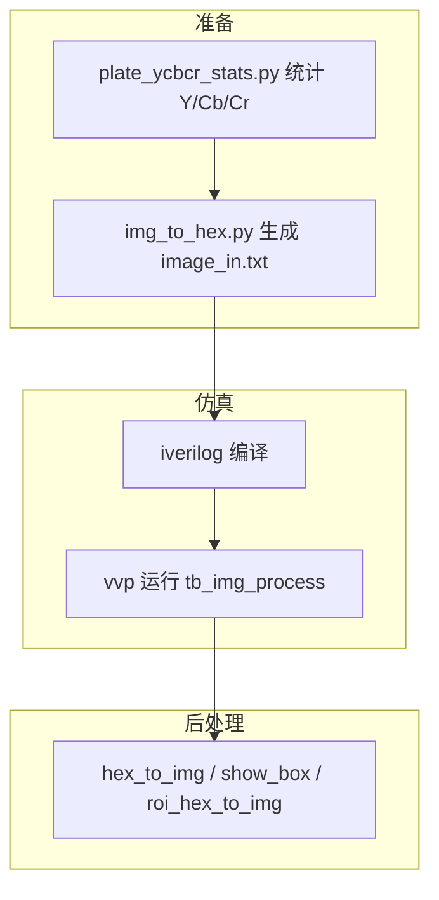
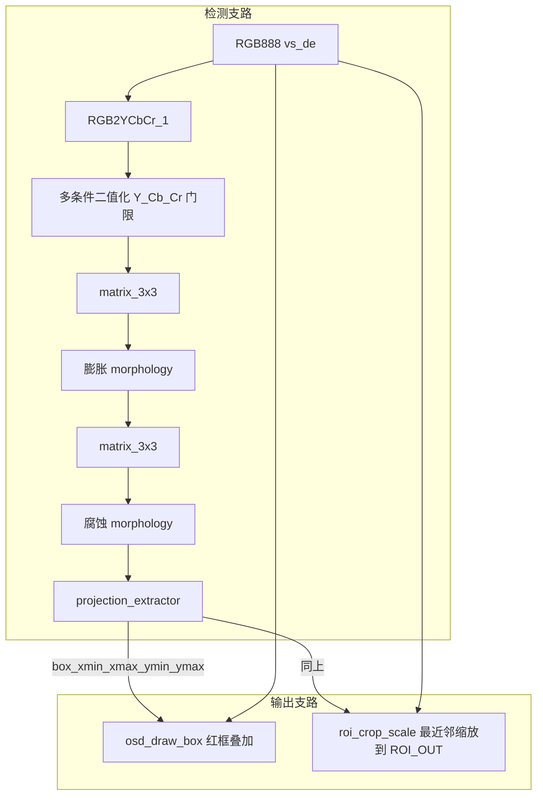

# 图像处理流水线 — 完整测试流程

本文描述从 **阈值统计 → 激励生成 → RTL 仿真 → 结果可视化** 的全流程，对应工程内 `tb_img_process.v`、`python/` 工具脚本及 `run_sim.bat`。

**当前默认分辨率**：与 **`test1.bmp`（640×480）** 对齐；`tb_img_process.v`、`image_process_wrapper.v` 及默认 `projection_extractor` / `roi_crop_scale` 的 `IMG_WIDTH`/`IMG_HEIGHT` 均为 **640 / 480**。若更换分辨率，须同步修改上述参数及 `img_to_hex` / `hex_to_img` / `show_box` 的宽高。

---

## 1. 流程总览



| 阶段 | 输入 | 输出 |
|------|------|------|
| 阈值统计（可选但推荐） | BMP/JPG | 终端分位数、可选 `stats_out/*.png` 直方图 |
| 激励生成 | 测试图 | `image_in.txt`（每行 6 位 hex：`rrggbb`） |
| 仿真 | `image_in.txt` + RTL | `image_out.txt`、`image_out_rgb.txt`、`image_out_roi.txt` |
| 可视化 | 上述三个 txt | JPG 灰度图 / 全彩 OSD / ROI 缩略图 |

### 1.1 RTL 图像处理数据流（`image_process_wrapper`）

顶层将 **RGB 摄像头流** 分为：**检测支路**（YCbCr → 二值 → 形态学 → 投影）与 **两条显示/输出支路**（原图 + 框坐标）。



| 模块 | 作用 |
|------|------|
| `RGB2YCbCr_1` | RGB565 高位截断后转 Y、Cb、Cr（与板级一致） |
| 二值化 | `blue_fg = f(Y,Cb,Cr)`，输出 0/255 |
| `matrix_3x3` + 膨胀 + `matrix_3x3` + 腐蚀 | **闭运算**：填字洞、抑小噪 |
| `projection_extractor` | 行列投影得外接框；**面积 + 宽高比** 通过才更新坐标并脉冲 `box_valid` |
| `osd_draw_box` | 帧首锁存框，在 **原 RGB** 上画红框 |
| `roi_crop_scale` | 帧首锁存框，从 **原 RGB** 裁 ROI 并缩放到 `ROI_OUT_W×ROI_OUT_H`，流式输出 |

**帧关系**：投影在帧末消隐区更新框；OSD / ROI 在下一帧用该框（与常见「上一帧结果、当前帧显示」一致）。

---

## 2. 环境与依赖

### 2.1 Verilog 仿真（Icarus Verilog）

- 需安装 **iverilog** 与 **vvp**，且可执行文件在系统 `PATH` 中。
- 工程根目录提供一键脚本：**`run_sim.bat`**（见第 5 节）。

### 2.2 Python 工具

```bash
cd e:\img_process_plan1\python
pip install -r requirements.txt
```

主要依赖：`opencv-python`、`numpy`；若使用 `plate_ycbcr_stats.py -o` 保存直方图，需 `matplotlib`。

---

## 3. 参数对齐（必查）

修改分辨率或 ROI 输出尺寸时，下列项必须 **一致**，否则仿真读错激励或 Python 还原图像错位。

| 项目 | 位置 | 说明 |
|------|------|------|
| 图像宽高 | `tb_img_process.v` 中 `IMG_WIDTH`、`IMG_HEIGHT` | 与 `img_to_hex.py` 的 `--width`、`--height` 相同 |
| ROI 输出尺寸 | `tb_img_process.v` 中 `ROI_OUT_W`、`ROI_OUT_H` | 与 `image_process_wrapper` 实例化的 `ROI_OUT_W`、`ROI_OUT_H` 相同；`roi_hex_to_img.py` 的 `--width`、`--height` 与此相同 |
| 仿真用投影门限 | `tb_img_process` 内 `PROJ_MIN_AREA` 等 | 640×480 下实例化为 **2000**（过小易引入噪声框）；若改分辨率可再调 |
| 工作目录 | 运行 `vvp` 的当前目录 | `$readmemh("image_in.txt")` 与 `$fopen` 均在 **仿真启动时的当前目录** 读写文件，请在 **`e:\img_process_plan1`** 下执行仿真 |

---

## 4. 分步操作

### 步骤 A：统计 Y/Cb/Cr（调 RTL 阈值前）

与 FPGA 一致时使用 **`--mode rtl`**（RGB565 截断 + `RGB2YCbCr_1` 整数公式）。

```bash
cd e:\img_process_plan1\python
python plate_ycbcr_stats.py -i ..\path\to\test1.bmp --mode rtl -o ..\stats_out
```

仅统计车牌区域时加 ROI（原图像素坐标）。若不知道 `x,y,w,h`，可用交互脚本先框选：

```bash
python pick_roi.py -i ..\test1.bmp
```

再在统计命令中使用终端打印的 `--roi`：

```bash
python plate_ycbcr_stats.py -i ..\test1.bmp --mode rtl --roi 200,300,240,120 -o ..\stats_out
```

（`--roi` 请按实际车牌位置修改，或用 `pick_roi.py` 交互获取。）

根据终端中的 P5/P10/P90 等，在 `image_process_wrapper.v` 中设置 `CB_MIN/MAX`、`CR_MIN/MAX`、`Y_MIN/MAX` 等参数。

---

### 步骤 B：由图片生成 `image_in.txt`

在 **`e:\img_process_plan1`** 下生成（路径可按需调整）：

```bash
python python\img_to_hex.py -i test1.bmp -o image_in.txt --width 640 --height 480 --resize letterbox
```

- **`--resize letterbox`**：保持宽高比，不足处黑边（竖拍场景常用）。
- **`--crop x,y,w,h`**：可先裁再缩，突出车牌区域。

行数必须等于 `IMG_WIDTH × IMG_HEIGHT`，每行格式为 **6 个十六进制字符** `rrggbb`，与 Verilog `$readmemh` 加载到 `img_mem[23:0]` 一致。

若无测试图，可用占位全黑图（全 `000000`）仅验证仿真能否跑通。

---

### 步骤 C：编译与仿真

**方式一（推荐）**：在工程根目录双击或命令行执行：

```bat
cd /d e:\img_process_plan1
run_sim.bat
```

**方式二**：手动调用 iverilog / vvp：

```bat
cd /d e:\img_process_plan1
iverilog -g2012 -Wall -o sim.vvp tb_img_process.v image_process_wrapper.v roi_crop_scale.v projection_extractor.v osd_draw_box.v matrix_3x3.v fifo_line_buf.v morphology.v RGB2YCbCr_1.v
vvp sim.vvp
```

成功时控制台会打印帧进度与结束信息；若 `projection_extractor` 在仿真中输出有效框，可能看到 `$display` 的坐标打印（取决于综合属性是否被忽略）。

---

### 步骤 D：将仿真输出还原为图像

在 **`e:\img_process_plan1`**（与 txt 同级）执行：

```bash
# 形态学后二值图（单字节 hex 每行）
python python\hex_to_img.py -i image_out.txt -o result_post.jpg --width 640 --height 480

# OSD 画框后的全彩图
python python\show_box.py -i image_out_rgb.txt -o result_osd.jpg --width 640 --height 480

# ROI 缩放流（尺寸须与 tb 中 ROI_OUT_W/H 一致，默认 64×32）
python python\roi_hex_to_img.py -i image_out_roi.txt -o result_roi.jpg --width 64 --height 32
```

---

## 5. Testbench 行为说明（`tb_img_process.v`）

### 5.1 仿真帧数

- `SIM_FRAMES = 3`：至少跑满 3 帧，使 **投影计算 → OSD/ROI 使用上一帧框** 的流水线稳定。
- **`frame_cnt`**：在 **`post_vs`（`out_vsync`）下降沿** 递增。
- **二值结果 `image_out.txt`**：仅在 **`frame_cnt == SIM_FRAMES - 1`**（即第 3 帧）且 `out_de` 有效时写入。
- **OSD 全彩 `image_out_rgb.txt`**：在 **`osd_frame_cnt == SIM_FRAMES - 1`** 且 `out_osd_de` 有效时写入（`osd_frame_cnt` 在 `out_osd_vs` 上升沿递增）。
- **ROI `image_out_roi.txt`**：在 **`roi_frame_cnt == SIM_FRAMES - 1`** 且 `roi_de` 有效时写入（`roi_frame_cnt` 在 `roi_vs` 上升沿递增）。

### 5.2 仿真输出文件

| 文件 | 内容格式 | 含义 |
|------|----------|------|
| `image_out.txt` | 每行 2 位 hex | 闭运算后二值 `post_data` |
| `image_out_rgb.txt` | 每行 6 位 hex `rrggbb` | OSD 叠加红框后的 RGB |
| `image_out_roi.txt` | 每行 6 位 hex `rrggbb` | 车牌 ROI 最近邻缩放到 `ROI_OUT_W×ROI_OUT_H` 的 RGB 流 |

仿真结束时 Testbench 会 `fclose` 上述文件；若路径不可写会 `$stop` 并报错。

### 5.3 时序与消隐

- `V_BACK` 等参数已加大，以便 ROI 模块在帧末连续输出 `ROI_OUT_W×ROI_OUT_H` 个像素时有足够空白周期（详见 `BUILD_NOTES.md`）。

---

## 6. 常见问题

| 现象 | 可能原因 | 处理 |
|------|----------|------|
| `$readmemh` 找不到文件 | 未在工程根目录运行 `vvp` | `cd` 到含 `image_in.txt` 的目录再运行 |
| 还原图像拉伸/错位 | `hex_to_img` / `show_box` 的宽高与 tb 不一致 | 与 `IMG_WIDTH`、`IMG_HEIGHT` 保持一致 |
| ROI 图尺寸不对 | `roi_hex_to_img` 参数与 `ROI_OUT_W/H` 不一致 | 修改脚本参数或 tb 参数并统一 |
| 全黑或无数值框 | 前景阈值过严或 `PROJ_MIN_AREA`/宽高比过严 | 用 `plate_ycbcr_stats` 重算阈值或放宽 wrapper / `projection_extractor` 参数 |
| `iverilog` 不是内部或外部命令 | 未加入 PATH | 将 Icarus 的 `bin` 目录加入系统环境变量 |

---

## 7. 相关文件索引

| 文件 | 作用 |
|------|------|
| `tb_img_process.v` | 顶层仿真、文件 IO、帧计数 |
| `run_sim.bat` | iverilog 编译 + vvp 运行 |
| `python/README.md` | Python 脚本简要说明 |
| `BUILD_NOTES.md` | 资源限制、下板对齐注意事项 |

以上为当前仓库内的 **完整离线测试流程**；下板调试时保持相同分辨率与阈值策略，仅将激励源换为摄像头接口即可在同一套参数上迭代。
